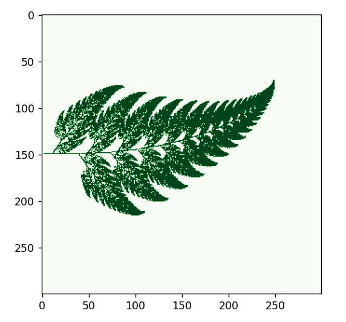
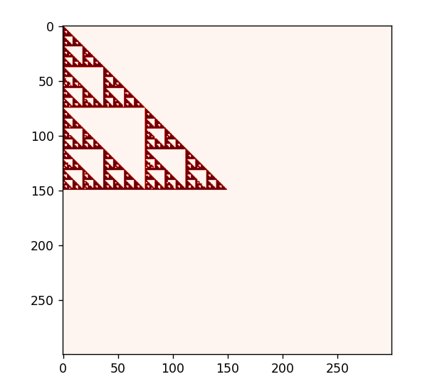
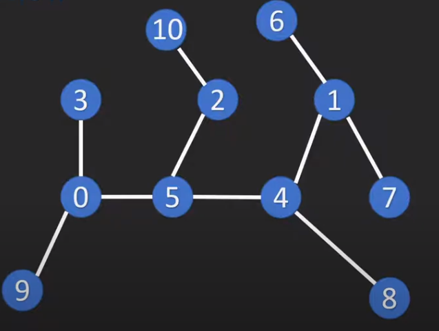

# Algorithms_overview

1. Fractals (fractals.py)

2. Sorting algorithms (/sorting)

a) Bubble Sort:
Time complexity: O(n^2) in the worst and average cases, O(n) in the best case (when the input array is already sorted)
Space complexity: O(1)

Basic idea: Iterate through the array repeatedly, comparing adjacent pairs of elements and swapping them if they are in the wrong order. Repeat until the array is fully sorted.

b) Selection Sort:
Time complexity: O(n^2) in all cases (worst, average, and best)
Space complexity: O(1)

Basic idea: Find the minimum element in the unsorted portion of the array and swap it with the first unsorted element. Repeat until the array is fully sorted.

c) Insertion Sort:
Time complexity: O(n^2) in the worst and average cases, O(n) in the best case (when the input array is already sorted)
Space complexity: O(1)

Basic idea: Build up a sorted subarray from left to right by inserting each new element into its correct position in the subarray. Repeat until the array is fully sorted.

d) Merge Sort - TODO 

e) Quicksort - TODO 

Comparison:
Bubble Sort and Selection Sort have the same worst-case time complexity of O(n^2), while Insertion Sort is slightly better with an average-case time complexity of O(n^2).
Insertion Sort has the best-case time complexity of O(n) when the input array is already sorted, which is not possible for Bubble Sort and Selection Sort.
Selection Sort and Insertion Sort both have the same space complexity of O(1), while Bubble Sort also has a space complexity of O(1).
Bubble Sort and Insertion Sort are stable sorting algorithms, meaning that they preserve the relative order of equal elements in the sorted array, while Selection Sort is not stable.
In terms of performance, Insertion Sort tends to perform better than Bubble Sort and Selection Sort for small datasets, while Bubble Sort and Selection Sort may perform better than Insertion Sort for larger datasets or datasets that are partially sorted.
Overall, each algorithm has its own advantages and disadvantages, and the choice of which algorithm to use depends on the specific requirements of the problem at hand.

3. Searching algorithms (/searching)

a) BFS (Breadth First Search)

b) DFS - TODO

c) Binary Search -  search algorithm that finds the position of a target value within a sorted array. Binary search compares the target value to the middle element of the array. If they are not equal, the half in which the target cannot lie is eliminated and the search continues on the remaining half, again taking the middle element to compare to the target value, and repeating this until the target value is found. If the search ends with the remaining half being empty, the target is not in the array.

4. Greedy algorithms (/greedy)

## TODO 

5. Dynamic programing algorithms (/dynamic)

## TODO 

6. Backtracking algorithms (/backtracking)

## TODO 

